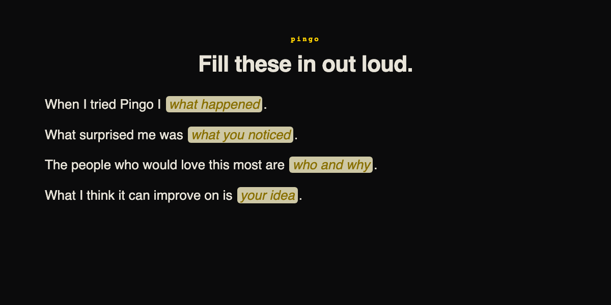
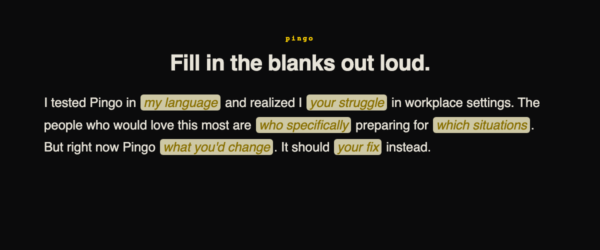
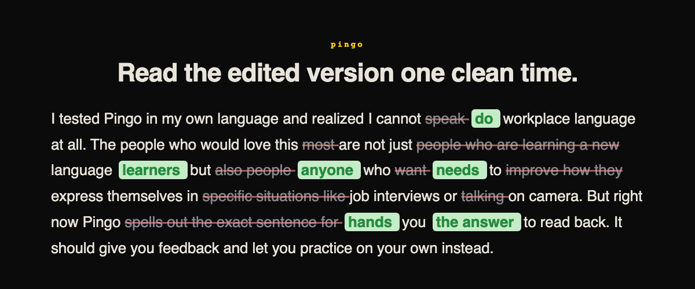

# Pingo Speaking Coach

A push-to-talk agent that helps advanced speakers organize their thoughts and say them better, in under 60 seconds.

## Why

Language apps teach beginners vocabulary. But advanced speakers already know the words. Their problem is different: they know what they want to say but cannot organize it clearly, cut the filler, or sound confident under pressure. Pingo coaches you through that gap.

## How It Works

Three rounds. Each round you speak, and the agent reshapes how you said it.

### Round 0: Dump your thoughts

The agent gives you four fill-in-the-blank stems. You say everything messy in one take.



### Round 1: Say it with structure

The agent rewrites your dump into a polished paragraph with blanks where your key content goes. You fill them in out loud. The structure teaches you better phrasing without giving you the words.



### Round 2: Read the polished version

The agent rewrites your speech one more time. A word-level diff highlights exactly what changed: grey strikethrough for removed words, green for replacements. You read the final version clean.



## The Insight

Advanced speakers do not need to be told the right answer. They need to practice composing it. Each round gives less scaffolding: stems, then structure with blanks, then inline edits. By the third round you are reading your own words, cleaned up, and the diff shows you exactly where your language was loose.

## Technical Challenges

**Real-time response (<500ms).** Deepgram STT streams interim transcripts over WebSocket as the user speaks. On release, the final transcript goes to Claude in one tool-use call. TTS streams back chunk-by-chunk so audio starts before synthesis finishes. Total silence gap from button release to first audio byte: ~400ms.

**Voice and conversation orchestration.** One Bun WebSocket server manages three async streams per session: mic PCM in, Deepgram STT out, Claude agent turn, Deepgram TTS out. Each round is a single push-to-talk cycle with no polling and no idle connections. State machine has three phases (orient, cloze, revision), each wired to a different tool schema so the agent cannot drift.

**Making AI responses feel natural.** The agent never writes filler or chatbot phrases. The system prompt bans 30+ words ("genuinely", "leverage", "let's unpack") and enforces a teacher voice. Round 2 uses a word-level LCS diff between the user's speech and the agent's rewrite, so edits are precise to the word and the unchanged parts stay exactly as the user said them.

## Stack

| Layer | Tool |
| --- | --- |
| STT | Deepgram Nova-3 (streaming, 16kHz) |
| Agent | Claude Sonnet 4.6 with tool use |
| TTS | Deepgram Aura 2 (streamed) |
| Diff | Word-level LCS on server, inline markup on client |
| Frontend | Vite + React + Tailwind |
| Backend | Bun + WebSockets |

## Run

```sh
cp .env.example .env
# fill DEEPGRAM_API_KEY, ANTHROPIC_API_KEY
bun install
bun run dev
```

Hold spacebar to talk. Release to send.
