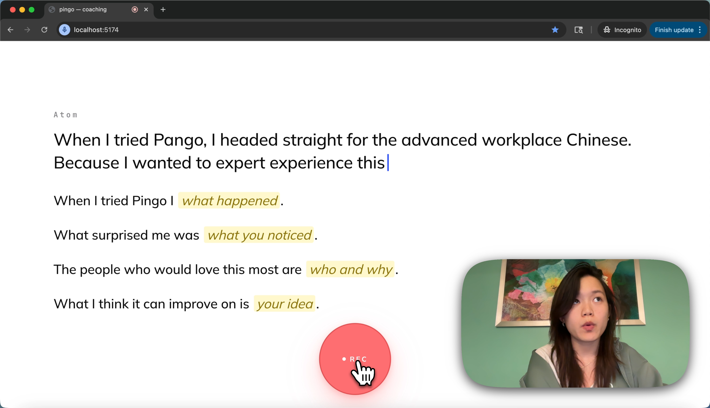
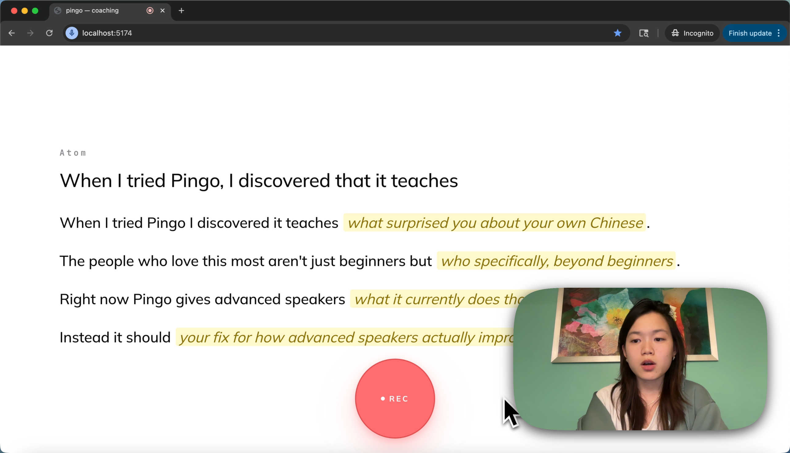
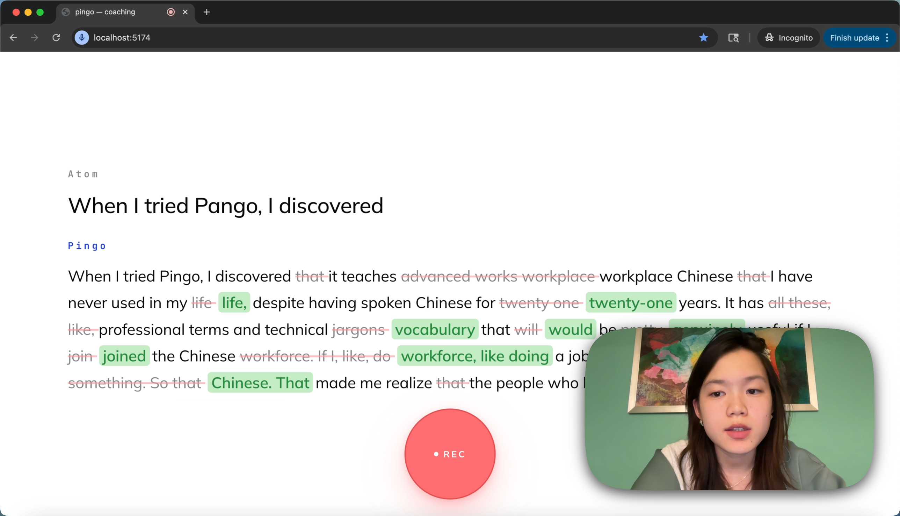
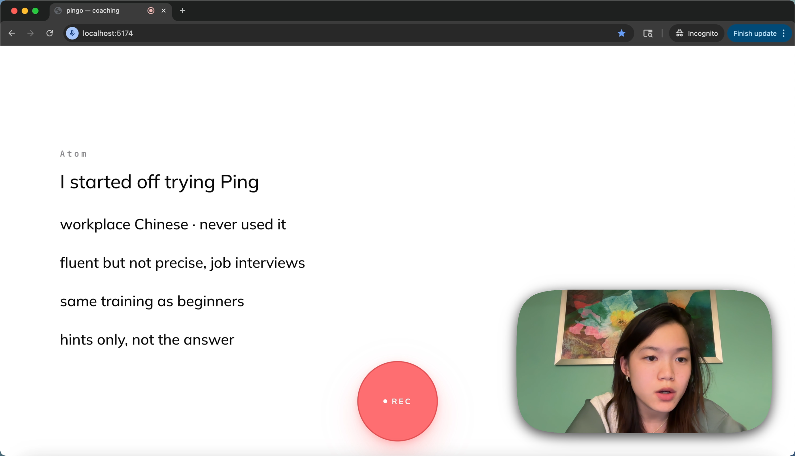

# Pingo Speaking Coach

A push-to-talk agent that helps advanced speakers organize their thoughts and say them better, in under 60 seconds.

## Why

Language apps teach beginners vocabulary. But advanced speakers already know the words. Their problem is different: they know what they want to say but cannot organize it clearly, cut the filler, or sound confident under pressure. Pingo coaches you through that gap.

## How It Works

Four rounds. Each round you speak, and the agent strips away one more layer of scaffolding until you are delivering from memory.

### Round 0: Dump your thoughts

The agent gives you four fill-in-the-blank stems. You say everything messy in one take.



### Round 1: Say it with structure

The agent rewrites your dump into 3–5 polished sentence stems, each with one blank at a key content slot. Same bullet shape as Round 0 — but now each stem is tuned to the ideas you actually expressed. You fill the blanks in out loud. The structure teaches you better phrasing without giving you the words.



### Round 2: Read the polished version

The agent rewrites your speech one more time as a complete paragraph. A word-level diff highlights exactly what changed: coral strikethrough for removed words, green for replacements. You read the final version clean.



### Round 3: Deliver from memory

The agent gives you a handful of short memory cues — 2–5 word key phrases, no full sentences. You look at them, internalize the arc, and deliver the pitch out loud without reading. This is the round that simulates actually saying it to the CEO.



## The Insight

Advanced speakers do not need to be told the right answer. They need to practice composing it. Each round strips one layer of scaffolding:

| Round | Scaffolding | What the user does |
| --- | --- | --- |
| 0 — Orient | 4 generic stems | Dump everything |
| 1 — Cloze | Tuned stems with blanks | Say it with structure |
| 2 — Revision | Full sentences, edits highlighted | Read the polish |
| 3 — Memory | Key phrases only | Deliver from memory |

By Round 3 you are speaking your own words, cleaned up and internalized, with just enough cues to hit every beat.

## Technical Challenges

**Real-time response (<500ms).** Deepgram STT streams interim transcripts over WebSocket as the user speaks. On release, the final transcript goes to Claude in one tool-use call. TTS streams back chunk-by-chunk so audio starts before synthesis finishes. Total silence gap from button release to first audio byte: ~400ms.

**Voice and conversation orchestration.** One Bun WebSocket server manages four async streams per session: mic PCM in, Deepgram STT out, Claude agent turn, Deepgram TTS out. Each round is a single push-to-talk cycle with no polling and no idle connections. State machine has six UI stages (idle, brief, orient, cloze, revision, done), and the iterate phase force-dispatches a different tool schema per round (`emit_pass` for cloze, `emit_revision` for round 2, `emit_pass` with `done:true` for the memory round) so the agent cannot drift. Every Pingo spoken moment routes through a single `pingoTurn` primitive — one function, one place to reason about.

**Making AI responses feel natural.** The agent never writes filler or chatbot phrases. The system prompt bans 30+ words ("genuinely", "leverage", "let's unpack") and enforces a teacher voice. Cloze stems pass a two-way grammar test: the sentence must read naturally both with the bracket label pronounced literally AND with a plausible user answer swapped in — no orphan tails, no mid-clause blanks. Round 2 uses a word-level LCS diff between the user's speech and the agent's rewrite, so edits are precise to the word and the unchanged parts stay exactly as the user said them.

## Stack

| Layer | Tool |
| --- | --- |
| STT | Deepgram Nova-3 (streaming, 16kHz) |
| Agent | Claude Sonnet 4.6 with tool use |
| TTS | Deepgram Aura 2 (streamed) |
| Diff | Word-level LCS on server, inline markup on client |
| Frontend | Vite + React + Tailwind |
| Backend | Bun + WebSockets |

## Run

```sh
cp .env.example .env
# fill DEEPGRAM_API_KEY, ANTHROPIC_API_KEY
bun install
bun run dev
```

Tap the button (or press spacebar) to start speaking. Tap again to send.
